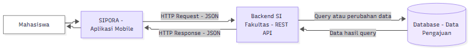

# Tugas 1 — Identifikasi Kebutuhan Aplikasi Bergerak

|            |                                                   |
| ---------- | ------------------------------------------------- |
| **Nama**   | Intan Kartika                                    |
| **NIM**    | 230660221018                                     |
| **Kelas**  | SI-VIIB                                          |
| **Domain** | Pengajuan surat observasi dan riset akademik — SIPORA |

---

## 1. Deskripsi Sistem

SIPORA (Sistem Informasi Pengajuan Observasi dan Riset Akademik) melibatkan **mahasiswa** sebagai pihak yang mengajukan surat observasi atau penelitian serta **petugas fakultas** yang melakukan pemeriksaan dan pemrosesan pengajuan. Dalam proses pengajuan surat, mahasiswa perlu menyampaikan data dan dokumen pendukung kepada pihak fakultas, sementara informasi mengenai status pengajuan dapat tersebar melalui komunikasi yang berbeda sehingga mahasiswa perlu menghubungi pihak terkait untuk mengetahui perkembangan pengajuannya. SIPORA dirancang untuk menyediakan satu aplikasi yang memungkinkan mahasiswa mengisi pengajuan, mengunggah dokumen, melihat status, serta memperoleh surat yang telah selesai dalam bentuk soft file. Aplikasi ini relevan digunakan dalam bentuk mobile karena mahasiswa dapat melakukan pengajuan melalui **interaksi sentuh** pada perangkat yang digunakan sehari-hari, serta dapat mengakses layanan dalam **konteks bergerak** ketika berada di lingkungan kampus maupun di luar kampus. Selain itu, aktivitas seperti memeriksa status pengajuan dirancang dalam **sesi penggunaan singkat**, sehingga mahasiswa dapat memperoleh informasi yang dibutuhkan tanpa harus melakukan proses yang panjang.

---

## 2. Diagram Arsitektur

Diagram arsitektur SIPORA mengikuti pola komunikasi antara aplikasi mobile, backend Sistem Informasi, dan database. Aplikasi mobile mengirimkan *HTTP Request* kepada backend untuk mengirim atau meminta data pengajuan, kemudian backend berkomunikasi dengan database untuk mengelola data. Hasil pemrosesan dikembalikan melalui *HTTP Response* kepada aplikasi mobile untuk ditampilkan kepada mahasiswa.



File sumber: [`diagram.mmd`](diagram.mmd) (Mermaid).

Alur komunikasi:

**SIPORA — Aplikasi Mobile → HTTP Request → Backend SI Fakultas → Database → HTTP Response → SIPORA — Aplikasi Mobile**

Diagram menunjukkan dua arah komunikasi, yaitu *request* dari aplikasi mobile menuju backend dan *response* dari backend kembali ke aplikasi mobile.

---

## 3. Tabel Kebutuhan

| **No.** | **Permintaan** | **Pengguna** | **Karakteristik Mobile yang Terkait** | **Fitur Aplikasi** | **Materi Pemenuh** |
| ------- | -------------- | ------------ | ------------------------------------- | ------------------ | ------------------ |
| 1 | Mengajukan surat observasi | Mahasiswa | **Interaksi sentuh** dan **sesi penggunaan singkat**: formulir harus mudah diisi melalui perangkat mobile | Form pengajuan surat observasi | Minggu 3 |
| 2 | Mengajukan surat penelitian | Mahasiswa | **Interaksi sentuh** dan **sesi penggunaan singkat**: proses pengajuan dapat dilakukan melalui beberapa input utama | Form pengajuan surat penelitian | Minggu 3 |
| 3 | Mengunggah dokumen pendukung pengajuan | Mahasiswa | **Konteks bergerak**: dokumen dapat dipilih dan dikirim melalui perangkat yang digunakan mahasiswa saat berada di lokasi berbeda | Upload file/dokumen | Minggu 7 |
| 4 | Melihat status pengajuan | Mahasiswa | **Sesi penggunaan singkat**: status dapat diperiksa dengan cepat tanpa menjalankan proses panjang | Halaman detail/status pengajuan | Minggu 5–6 |
| 5 | Melihat riwayat pengajuan | Mahasiswa | **Layar kecil dan variatif** serta **sesi penggunaan singkat**: informasi riwayat perlu ditampilkan secara ringkas dan mudah dipindai | Halaman riwayat dengan ListView | Minggu 5–6 |
| 6 | Menerima informasi perubahan status pengajuan | Mahasiswa | **Sesi penggunaan singkat** dan **konteks bergerak**: pengguna tidak harus selalu membuka aplikasi untuk mengetahui perubahan status | Notifikasi status pengajuan | Minggu 11 |
| 7 | Mengunduh surat yang telah selesai | Mahasiswa | **Konteks bergerak**: surat dapat diakses sebagai soft file melalui perangkat mobile ketika dibutuhkan | Download/akses file PDF | Minggu 7–10 |
| 8 | Memvalidasi data dan dokumen pengajuan | Petugas Fakultas | Tidak berlaku karena proses validasi utama dilakukan pada sisi server | **Di luar lingkup (backend SI)** — validasi dan pemeriksaan data pengajuan pada backend | Di luar PAB (Backend SI) |
| 9 | Memproses dan menerbitkan surat pengajuan | Petugas Fakultas | Tidak berlaku karena proses penerbitan merupakan proses bisnis pada sisi backend SI | **Di luar lingkup (backend SI)** — pengelolaan proses dan penerbitan surat | Di luar PAB (Backend SI) |

**Catatan lingkup:** baris 1–7 merupakan kebutuhan yang menjadi bagian dari aplikasi mobile SIPORA, sedangkan baris 8–9 merupakan proses pada sisi backend Sistem Informasi. Aplikasi mobile berperan mengirimkan data pengajuan dan menampilkan hasil pemrosesan dari backend.

---

## 4. Bukti Environment Siap

| **Bukti** | **File** |
| --------- | -------- |
| `flutter doctor -v` sebelum perbaikan | [`flutter-doctor/sebelum.png`](flutter-doctor/sebelum.png) |
| `flutter doctor -v` sesudah perbaikan | [`flutter-doctor/sesudah.png`](flutter-doctor/sesudah.png) |
| Aplikasi counter berjalan pada target web | [`aplikasi.png`](aplikasi.png) |

Environment Flutter telah dikonfigurasi untuk pengembangan aplikasi menggunakan Flutter. Pengujian awal dilakukan pada platform web menggunakan Google Chrome.

---

## 5. Refleksi

Untuk domain SIPORA, fitur perangkat yang paling relevan adalah **file** karena mahasiswa perlu mengunggah dokumen pendukung dan memperoleh surat yang telah selesai dalam bentuk soft file. Penggunaan file pada perangkat mobile memungkinkan proses pertukaran dokumen dilakukan langsung dari perangkat yang digunakan mahasiswa tanpa harus berpindah ke perangkat lain. Fitur tersebut mendukung alur pengajuan observasi dan penelitian karena dokumen merupakan bagian penting dalam proses pengajuan.

---

## 6. Struktur Folder

```text
230660221018-IntanKartika/
├── README.md
├── diagram.png
├── diagram.mmd
├── flutter-doctor/
│   ├── sebelum.png
│   └── sesudah.png
└── aplikasi.png