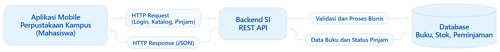

# Tugas 1 — Identifikasi Kebutuhan Aplikasi Bergerak

|            |                                                   |
| ---------- | ------------------------------------------------- |
| **Nama**   | Syifa Nur Insani                                    |
| **NIM**    | 230660221030                                             |
| **Kelas**  | SI-VIIB                                           |
| **Domain** | Aplikasi Perpustakaan Kampus — PustakaKu          |

---

## 1. Deskripsi Sistem

PustakaKu merupakan aplikasi perpustakaan kampus yang melibatkan **mahasiswa** sebagai pengguna utama dan **petugas perpustakaan** sebagai pihak yang mengelola data buku serta peminjaman. Saat ini, mahasiswa perlu datang ke perpustakaan untuk memastikan ketersediaan buku dan melakukan peminjaman, sehingga proses pencarian dan peminjaman buku menjadi kurang praktis. PustakaKu dirancang untuk menyediakan layanan katalog buku, pencarian buku, peminjaman, informasi status peminjaman, serta pengingat tenggat pengembalian melalui aplikasi mobile. Aplikasi ini relevan digunakan dalam bentuk mobile karena mahasiswa dapat mengakses layanan melalui **interaksi sentuh** pada perangkat yang digunakan sehari-hari, serta memanfaatkan **konteks bergerak** untuk mencari dan melihat informasi buku dari berbagai lokasi. Selain itu, fitur katalog dirancang agar dapat ditampilkan secara ringkas dalam **sesi penggunaan singkat**, sehingga mahasiswa dapat memperoleh informasi buku dengan cepat.

---

## 2. Diagram Arsitektur

Diagram arsitektur PustakaKu mengikuti pola komunikasi antara aplikasi mobile, backend Sistem Informasi, dan database. Aplikasi mobile mengirimkan *HTTP Request* kepada backend untuk meminta data katalog atau mengajukan peminjaman buku. Backend memvalidasi permintaan dan berkomunikasi dengan database untuk mengelola data buku, stok, dan peminjaman. Hasil pemrosesan dikembalikan melalui *HTTP Response* kepada aplikasi mobile untuk ditampilkan kepada mahasiswa.



File sumber: [`diagram.mmd`](diagram.mmd) (Mermaid).

Alur komunikasi:

**PustakaKu — Aplikasi Mobile → HTTP Request → Backend SI Perpustakaan → Database → HTTP Response → PustakaKu — Aplikasi Mobile**

Diagram menunjukkan dua arah komunikasi, yaitu *request* dari aplikasi mobile menuju backend dan *response* dari backend kembali ke aplikasi mobile.

---

## 3. Tabel Kebutuhan

| **No.** | **Permintaan** | **Pengguna** | **Karakteristik Mobile yang Terkait** | **Fitur Aplikasi** | **Materi Pemenuh** |
| ------- | -------------- | ------------ | ------------------------------------- | ------------------ | ------------------ |
| 1 | Melihat daftar buku | Mahasiswa | **Layar kecil dan sesi penggunaan singkat**: katalog ditampilkan secara ringkas dan mudah dibaca | Halaman katalog buku | Minggu 3, 5 |
| 2 | Melihat detail dan ketersediaan buku | Mahasiswa | **Layar kecil dan interaksi sentuh**: informasi buku mudah diakses melalui sentuhan | Halaman detail buku | Minggu 3, 5 |
| 3 | Mencari buku berdasarkan judul atau penulis | Mahasiswa | **Sesi penggunaan singkat**: pencarian membantu pengguna menemukan buku dengan cepat | Fitur pencarian buku | Minggu 5–6 |
| 4 | Meminjam buku yang stoknya tersedia | Mahasiswa | **Interaksi sentuh** dan **konektivitas**: pengajuan peminjaman dilakukan melalui aplikasi dan diproses backend | Tombol pinjam dan validasi stok melalui backend | Minggu 6, 9–10 |
| 5 | Melihat riwayat dan status peminjaman | Mahasiswa | **Sesi penggunaan singkat**: informasi peminjaman dapat diperiksa dengan cepat | Halaman riwayat dan status peminjaman | Minggu 5–6, 9–10 |
| 6 | Menerima pengingat tenggat pengembalian | Mahasiswa | **Konteks bergerak**: pengguna dapat memperoleh pengingat meskipun tidak sedang membuka aplikasi | Notifikasi pengembalian | Minggu 11 |
| 7 | Melihat katalog terakhir saat offline | Mahasiswa | **Konektivitas terbatas**: data katalog terakhir tetap dapat diakses saat jaringan tidak tersedia | Penyimpanan lokal katalog | Minggu 7 |
| 8 | Mengelola data buku dan stok | Petugas perpustakaan | Tidak berlaku karena pengelolaan utama dilakukan pada sisi server | **Di luar lingkup aplikasi mobile mahasiswa** — pengelolaan data buku melalui backend SI | Backend SI |
| 9 | Memvalidasi dan memproses peminjaman | Petugas perpustakaan | Tidak berlaku karena validasi dan pemrosesan merupakan proses bisnis pada sisi backend | **Di luar lingkup aplikasi mobile mahasiswa** — validasi stok dan pencatatan peminjaman | Backend SI |

**Catatan lingkup:** baris 1–7 merupakan kebutuhan yang menjadi bagian dari aplikasi mobile PustakaKu, sedangkan baris 8–9 merupakan proses pada sisi backend Sistem Informasi. Aplikasi mobile berperan sebagai antarmuka mahasiswa untuk mengakses katalog dan mengajukan peminjaman, sementara backend mengelola data dan aturan bisnis.

---

## 4. Bukti Environment Siap

| **Bukti** | **File** |
| --------- | -------- |
| `flutter doctor -v` sebelum perbaikan | [`flutter-doctor/sebelum.png`](flutter-doctor/sebelum.png) |
| `flutter doctor -v` sesudah perbaikan | [`flutter-doctor/sesudah.png`](flutter-doctor/sesudah.png) |
| Aplikasi Flutter berjalan pada target web | [`aplikasi.png`](aplikasi.png) |

Environment Flutter dikonfigurasi untuk pengembangan aplikasi menggunakan Flutter. Pengujian awal dilakukan pada platform web menggunakan Google Chrome.

---

## 5. Refleksi

Fitur perangkat yang paling relevan untuk PustakaKu adalah **notifikasi** karena dapat mengingatkan mahasiswa tentang tenggat pengembalian buku. Selain itu, penyimpanan lokal penting agar mahasiswa tetap dapat melihat katalog terakhir ketika koneksi internet tidak tersedia. Kedua fitur tersebut mendukung kemudahan akses layanan perpustakaan melalui perangkat mobile.

---

## 6. Struktur Folder

```text
[230660221030]-[SyifaNurInsani]/
├── README.md
├── diagram.png
├── diagram.mmd
├── flutter-doctor/
│   ├── sebelum.png
│   └── sesudah.png
└── aplikasi.png
```